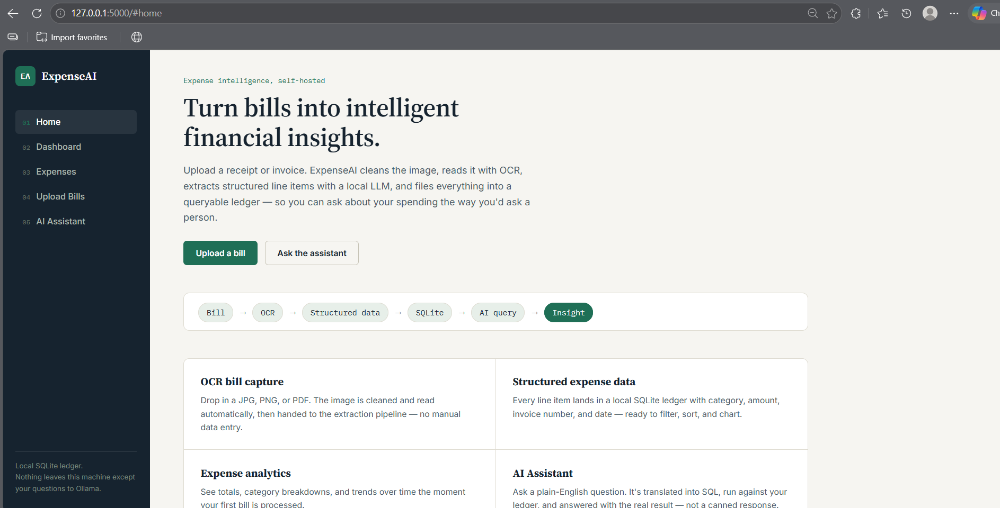
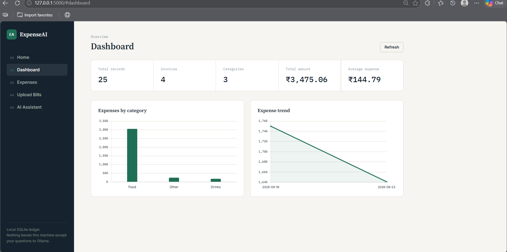
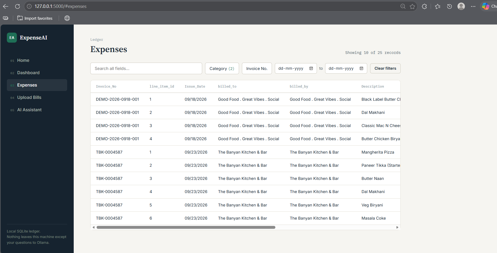
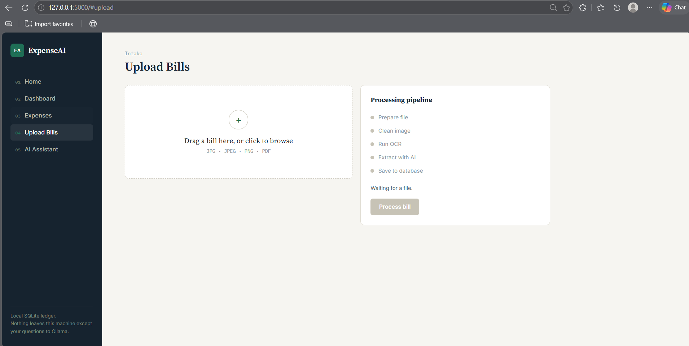

# ExpenseAI

**Turn bills into intelligent financial insights.**

ExpenseAI is a self-hosted expense management tool. Upload a bill or invoice (JPG, PNG, or PDF), and it's automatically cleaned, read with OCR, parsed into structured line items by a local LLM (Ollama), and filed into a queryable SQLite ledger. Ask questions about your spending in plain English and get answers pulled straight from your data — no cloud services, nothing leaves your machine except your questions to Ollama.

```
Bill → OCR → Structured Data → SQLite → AI Query → Insight
```

## Features

- **OCR bill capture** — drag-and-drop upload for JPG, JPEG, PNG, and PDF, with automatic image cleaning and text extraction
- **AI-powered extraction** — a local LLM turns raw OCR text into structured line items (invoice number, date, category, item, amount)
- **Expense analytics** — a dashboard with totals, category breakdowns, and spend-over-time trends
- **Searchable ledger** — filter expenses by category, invoice number, and date range, or free-text search across every field
- **AI Assistant** — ask questions in plain English ("which category has the most expenses?"); the question is translated into a read-only SQL query, run against the database, and answered with the real result
- **Local-first** — SQLite for storage, Ollama for inference; no data leaves your machine

## Screenshots

## Screenshots







## Tech stack

| Layer | Technology |
|---|---|
| Frontend | HTML, CSS, vanilla JavaScript, Chart.js (vendored, no CDN dependency) |
| Backend | Flask (Python) |
| Database | SQLite |
| OCR | Custom image-cleaning + OCR pipeline |
| AI | Ollama (local LLM) for invoice parsing and natural-language-to-SQL |

## Project structure

```
.
├── server.py                  # Flask API — routes, dashboard aggregation, SQL safety guard
├── ollama3.py                 # LLM integration (NL question → SQL)
├── image_cleaning.py          # Bill image preprocessing
├── ocr_processor.py           # OCR extraction
├── parser.py                  # Structured line-item extraction from OCR text
├── data_insertion.py          # Writes parsed line items into SQLite
├── ocr_master.db              # SQLite database (created on first run)
├── bill_image/                # Uploaded bill images (created on first run)
├── image_cleaning_one_folder/ # Cleaned images (created on first run)
├── static/
│   ├── index.html             # App shell — Home, Dashboard, Expenses, Upload Bills, AI Assistant
│   ├── css/style.css
│   └── js/
│       ├── app.js             # Routing, API calls, charts, chat, upload pipeline
│       └── chart.umd.min.js   # Vendored Chart.js
└── README.md
```

## Getting started

### Prerequisites

- Python 3.10+
- [Ollama](https://ollama.com) installed and running locally, with a model pulled (e.g. `ollama pull llama3`)
- (Optional) [PyMuPDF](https://pymupdf.readthedocs.io/) if you plan to upload PDF bills: `pip install pymupdf`

### Installation

```bash
git clone https://github.com/<your-username>/expenseai.git
cd expenseai
pip install -r requirements.txt
```

### Running

Make sure Ollama is running, then:

```bash
python server.py
```

Open [http://localhost:5000](http://localhost:5000) in your browser.

## Usage

1. **Upload Bills** — drag in a bill (JPG/PNG/PDF) and click **Process bill**. Watch it move through prepare → clean → OCR → extract → save.
2. **Dashboard** — see total records, invoices, categories, total/average spend, and charts by category and over time.
3. **Expenses** — browse the full ledger with search, category/invoice filters, and a date range.
4. **AI Assistant** — ask things like:
   - "Which category has the highest spending?"
   - "Show my largest invoices"
   - "How many invoices do I have?"
   - "Give me an overview of my expenses"

## API reference

All endpoints are served by `server.py`.

| Method | Endpoint | Description |
|---|---|---|
| `GET` | `/api/dashboard` | KPIs and chart data (totals, by-category, trend) |
| `GET` | `/api/expenses` | Filtered ledger rows — query params: `category`, `invoice`, `search`, `date_from`, `date_to` |
| `GET` | `/api/expenses/filters` | Available categories/invoices for filter menus |
| `POST` | `/api/upload` | Multipart file upload |
| `POST` | `/api/process` | Starts the OCR → parse → insert pipeline for an uploaded file; returns a `job_id` |
| `GET` | `/api/process/status/<job_id>` | Poll pipeline progress |
| `POST` | `/api/chat` | Natural-language question → SQL → query results |

Only read-only SQL (`SELECT`, `PRAGMA`, `WITH`) is ever executed against the database — the AI Assistant's generated queries are validated before they run, and mutating statements (`DELETE`, `UPDATE`, `DROP`, `INSERT`, etc.) are rejected.

## Roadmap

- [ ] Multi-user support
- [ ] Export to CSV/Excel
- [ ] Budget alerts
- [ ] Receipt image preview in the Expenses table

## Contributing

Issues and pull requests are welcome. Please open an issue to discuss significant changes before submitting a PR.

## License

<!-- Add your license here, e.g. MIT -->